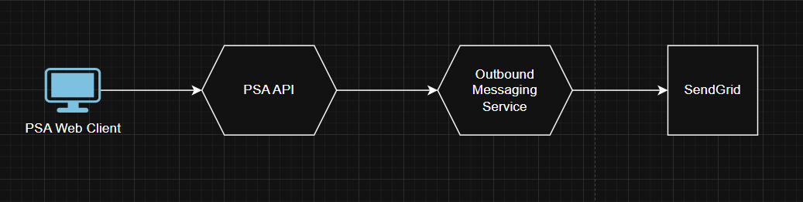

# PSA Web ‐ Configuring Messaging Services
 
marcbarbierrev edited this page last week · 9 revisions
Overview
Messaging in PSA consists of both outbound and inbound messaging. This document covers how to configure all of the relevant services for both inbound and outbound messaging.

Note: Currently (as of January 2025) only Email is supported as a messaging type, with plans to later enable other types of messaging.

Outbound Messaging
Outbound messaging for PSA is facilitated by an API called the "messaging-service". This service is provider agnostic, but currently uses a common Sendgrid account for all outbound emails. Data flow from the front end all the way to SendGrid follows the following diagram:



Configurations
PSA API Database (In progress)
(Current State) Only one from email address can be configure per environment. There is currently work-in-progress to make this configurable per client.

(Future state) The client needs to go into the Admin->Email Settings panel and populate their Outgoing Email Address.

SendGrid
SendGrid needs to be configured to have an additional "From" address matching the client's desired from address. Until this is automated via API calls this should be completed via a CA ticket.

Client DNS Settings
When the client configures a "From" Email, they will receive an automated email from PSA with instructions for configuring the DNS settings of their client-managed email inbox.

Inbound Messaging
Inbound Messaging for PSA is facilitated by the Inbound-Messaging Microservice. This service polls mailboxes periodically to retrieve new emails, processes them, and then creates an event to notify subscribing services that a new email has been retrieved.

Data flow follows the following diagram: image

Rev.io Managed Inbox
A CA ticket should be created to spin up a new Rev.io managed inbox that the client will forward their emails to. After the inbox has been created, the Inbound Messaging Service Principal should be added to the inbox with the correct permissions. Someone with the proper access to the inbox should run the following script

New-ServicePrincipal -AppId "<app-id of service principal>" -ObjectId "<object-id of service principal>"
 
Add-MailboxPermission -Identity "client1_dev@psarev.io" -User "<app-id of service principal>" -AccessRights FullAccess
Replace the Identity with the appropriate email address.

Registering Inbox
The newly created inbox should then be registered with the Inbound Messaging Service. Currently this can only be done through Postman using the following call to the inbound messaging service.

Note: The Tenant ID, ClientID, and SecretKey of the service principal can be found in Azure Key Vault (dev-psa-web-kv-2644) under the following secret names:

dev-psarevio-inbound-emails-tennant-id dev-psarevio-inbound-emails-client-id dev-psarevio-inbound-emails-client-secret
```
URL:
{Base URL}/inbox/subscribe

Method: POST

Body:
{
    "emailAddress": "client1_dev@psarev.io",  // Name of the Rev.io Managed inbox          
    "provider": "Office365", // Should not change
    "authenticationType": "AppRegistration", // Should not change
    "credentials": {
        "clientId": "<ClientId of the service principal>",
        "clientSecret": "<SecretKey of the service principal>",
        "tenantId": "<Azure tenant ID)"
    },
    "clientCode": "DEV", // From Billing
    "billProfileId": "1001", // From Billing. Can be an empty string
    "stateKey": "1" // Should be set to 1 for a new instance
}
```